# ESG-Risk-Analysis:  Uncovering Hidden Risks in Corporate Responsibility

To identify ESG risk patterns across sectors, company sizes, and governance practices using Python-based data analysis and visualization, delivering insights that could support sustainable investing decisions and risk mitigation strategies.

## Table of Contents
- [About the Project](#About-the-Project)
- [Objectives](#Objectives)
- [Tools Used](#Tools-Used)
- [Data Source](#Data-Source)
- [SQL Queries](#SQL-Queries)
- [Python Analysis](#Python-Analysis) 
- [Power BI Dashboard](#Power-BI-Dashboard)
- [key Insights](#Key-Insights)
- [Contact](#contact)

---

## About the Project
This project analyzes the Environmental, Social, and Governance (ESG) risk profile of companies across sectors using Python, SQL, and Power BI. It uncovers patterns in ESG performance, controversy levels, governance quality, and industry benchmarks to support investors, analysts, and decision-makers with actionable insights.

## Objectives
The objectives of the projects are to analyze and discover:
- Industry-Wide ESG Risk Benchmarking
- Identifying High-Risk Companies and Controversies
- Relationship Between ESG Risk and Company Size
- Governance and ESG Risk Correlation
  
## Tools Used
- **SQL**: For structured querying & analysis.
- **Python**: For deep data exploration using pytohn libraries such as Pandas, Matplotlib, Seaborn, Plotly.express etc.
- **Power BI**: For creating interactive ESG dashboards.

## Data Source
This project uses sample data that simulates typical ESG data:
- Symbol: The unique stock symbol associated with the company
- Name: The official name of the company.
- Address: The primary address of the company's headquarters.
- Sector: The sector of the economy in which the company operates.
- Industry: The specific industry to which the company belongs.
- Full Time Employees: The total count of full-time employees working within the company.
- Description: A concise overview of the company's core business and activities.
- Total ESG Risk Score: An aggregate score evaluating the company's overall ESG risk.
- Environment Risk Score: A score indicating the company's environmental sustainability and impact.
- Governance Risk Score: A score reflecting the quality of the company's governance structure.
- Social Risk Score: A score assessing the company's societal and employee-related practices.
- Controversy Level: The level of controversies associated with the company's ESG practices.
- Controversy Score: A numerical representation of the extent of ESG-related controversies.
- ESG Risk Percentile: The company's rank in terms of ESG risk compared to others.
- ESG Risk Level: A categorical indication of the company's ESG risk level.


## SQL Queries

**Column names and their data types**
```SQL
SELECT COLUMN_NAME, DATA_TYPE
FROM INFORMATION_SCHEMA.COLUMNS
WHERE TABLE_NAME = 'SP_500_ESG_Risk_Ratings'; 
```
**Cleaning and Changing types of ESG components columns**
```SQL
UPDATE SP_500_ESG_Risk_Ratings
SET Environment_Risk_Score = NULLIF(LTRIM(RTRIM(REPLACE(Environment_Risk_Score, ',', ''))), '');;

ALTER TABLE SP_500_ESG_Risk_Ratings
ALTER COLUMN Environment_Risk_Score FLOAT;

--
UPDATE SP_500_ESG_Risk_Ratings
SET Governance_Risk_Score = NULLIF(LTRIM(RTRIM(REPLACE(Governance_Risk_Score, ',', ''))), '');

ALTER TABLE SP_500_ESG_Risk_Ratings
ALTER COLUMN Governance_Risk_Score FLOAT;

--
UPDATE SP_500_ESG_Risk_Ratings
SET Social_Risk_Score = NULLIF(LTRIM(RTRIM(REPLACE(Social_Risk_Score, ',', ''))), '');

ALTER TABLE SP_500_ESG_Risk_Ratings
ALTER COLUMN Social_Risk_Score FLOAT;

UPDATE SP_500_ESG_Risk_Ratings
SET Total_ESG_Risk_score = NULLIF(LTRIM(RTRIM(REPLACE(Total_ESG_Risk_score, ',', ''))), '');

ALTER TABLE SP_500_ESG_Risk_Ratings
ALTER COLUMN Total_ESG_Risk_score FLOAT;
```
**Industries with average ESG components Score**
```SQL
SELECT
    Industry,
    AVG([Environment_Risk_Score]) AS Avg_Environment_Risk_Score,
    AVG([Governance_Risk_Score]) AS Avg_Governance_Risk_Score,
    AVG([Social_Risk_Score]) AS Avg_Social_Risk_Score
FROM SP_500_ESG_Risk_Ratings
WHERE Industry is not null
GROUP BY Industry
ORDER BY Industry;
```
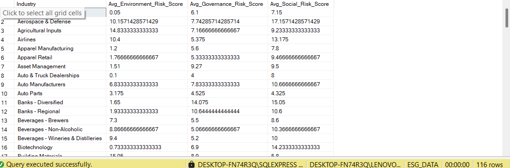

**Top 10 Industry by average Environment Risk Score**
```SQL
SELECT TOP 10
    Industry,
    AVG([Environment_Risk_Score]) AS Avg_Environment_Risk_Score
FROM
    SP_500_ESG_Risk_Ratings
GROUP BY
    Industry
ORDER BY
    Avg_Environment_Risk_Score DESC;
```
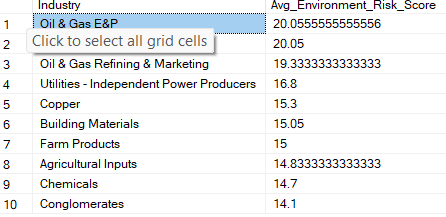

**Top 10 Industry by average Governance Risk Score**
```SQL
SELECT TOP 10
    Industry,
    AVG([Governance_Risk_Score]) AS Avg_Governance_Risk_Score
FROM
    SP_500_ESG_Risk_Ratings
GROUP BY
    Industry
ORDER BY
    Avg_Governance_Risk_Score DESC;
```
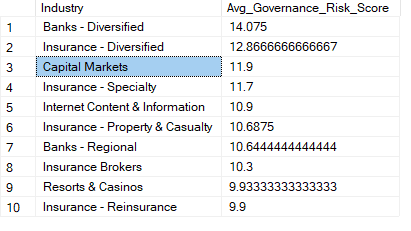

**Top 10 Industry by average Social Risk Score**
```SQL
SELECT TOP 10
    Industry,
    AVG([Social_Risk_Score]) AS Avg_Social_Risk_Score
FROM
    SP_500_ESG_Risk_Ratings
GROUP BY
    Industry
ORDER BY
    Avg_Social_Risk_Score DESC;
```
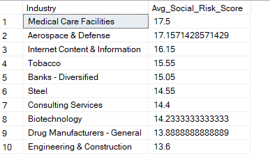

**Sector-wise average ESG components**
```SQL
SELECT
    Sector,
    AVG([Environment_Risk_Score]) AS Avg_Environment_Risk_Score,
    AVG([Governance_Risk_Score]) AS Avg_Governance_Risk_Score,
    AVG([Social_Risk_Score]) AS Avg_Social_Risk_Score
FROM
    SP_500_ESG_Risk_Ratings
WHERE Sector is not null
GROUP BY
    Sector
ORDER BY
    Sector;
```
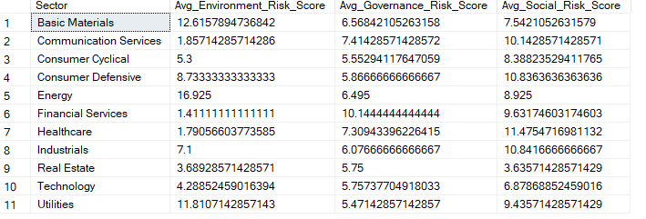

**Risk Level-wise Average Total ESG Score**
```SQL
SELECT
    [ESG_Risk_Level],
    AVG([Total_ESG_Risk_score]) AS Avg_Total_ESG_Risk_Score
FROM
    SP_500_ESG_Risk_Ratings
WHERE ESG_Risk_Level is not null
GROUP BY
    [ESG_Risk_Level]
ORDER BY
    CASE 
        WHEN [ESG_Risk_Level] = 'Negligible' THEN 1
        WHEN [ESG_Risk_Level] = 'Low' THEN 2
        WHEN [ESG_Risk_Level] = 'Medium' THEN 3
        WHEN [ESG_Risk_Level] = 'High' THEN 4
        ELSE 5
    END;
```
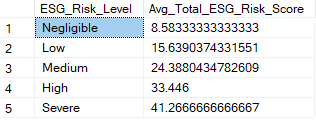

**Frequency Count of Sector**
```SQL
SELECT
    Sector,
    COUNT(*) AS Frequency
FROM
    SP_500_ESG_Risk_Ratings
GROUP BY
    Sector
ORDER BY
    Frequency DESC;
```
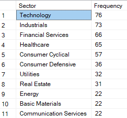

**Correlation-like Check between Governance and Total ESG Risk (Not true correlation but a comparative trend)**
```SQL
SELECT ROUND(AVG(Governance_Risk_Score), 2) AS Avg_Governance,
       ROUND(AVG(Total_ESG_Risk_Score), 2) AS Avg_Total_ESG
FROM SP_500_ESG_Risk_Ratings;
```
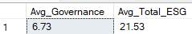

 **Count of Companies per ESG Risk Level**
```SQL
SELECT [ESG_Risk_Level], COUNT(*) AS Company_Count
FROM SP_500_ESG_Risk_Ratings
WHERE ESG_Risk_Level is not null
GROUP BY [ESG_Risk_Level]
ORDER BY Company_Count DESC;
```
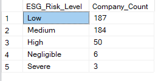

## Python Analysis
Importing all the necessary library
```python
import pandas as pd
import numpy as np
import seaborn as sns
import matplotlib.pyplot as plt
%matplotlib inline
import plotly.express as px
from tabulate import tabulate
from scipy import stats
import warnings
warnings.filterwarnings('ignore')
```

Importing the CSV data
```python
df = pd.read_csv('SP 500 ESG Risk Ratings.csv')
```

Creating a Summary Statistics Overview Table
```python
summary_stats = df.describe().drop("count")

# Apply styling to the summary table
styled_stats = (
    summary_stats
    .style.background_gradient(axis=0, cmap="BuGn")  # Green gradient
    .set_properties(**{"text-align": "center"})       # Center-align text
    .set_table_styles([
        {"selector": "th", "props": [("background-color", "black"), ("color", "white")]}
    ])
    .set_caption(" Summary Statistics Overview")
)

styled_stats
```
 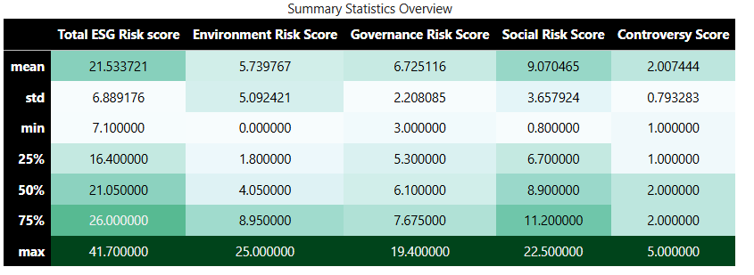

**Creating a Data Overview Summary Table**
```python

def check_dataframe(df):
    summary = []
    
    for col in df.columns:
        col_dtype = df[col].dtype
        total_instances = df[col].count()
        unique_values = df[col].nunique()
        null_values = df[col].isnull().sum()
        duplicate_rows = df.duplicated().sum()
        
        summary.append([
            col, col_dtype, total_instances, unique_values, null_values, duplicate_rows
        ])
    
    result_df = pd.DataFrame(
        summary,
        columns=["Column", "Data Type", "Instances", "Unique Values", "Nulls", "Duplicates"]
    )
    
    return result_df

# Remove rows with nulls in 'Sector' and 'Total ESG Risk score'
df_cleaned = df.dropna(subset=['Sector', 'Total ESG Risk score']).reset_index(drop=True)

print(f"Shape of the cleaned dataset: {df_cleaned.shape}")

# Generate and style the data summary
styled_summary = (
    check_dataframe(df_cleaned)
    .style.background_gradient(axis=0, cmap="BuGn")
    .set_properties(**{"text-align": "center"})
    .set_table_styles([{"selector": "th", "props": [("background-color", "black"), ("color", "white")]}])
    .set_caption("🔍 Data Overview Summary")
)

styled_summary
```
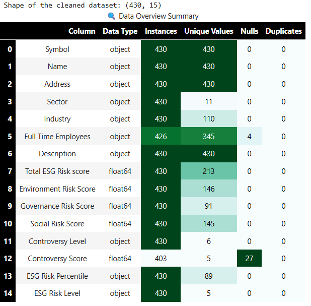

**Creating visuals of Distribution of all ESG scores and Table of outliers in ESG scores**
```python

esg_cols = ['Total ESG Risk score', 'Environment Risk Score', 'Governance Risk Score', 'Social Risk Score']
esg_data = df[esg_cols]

colors = ["#6528F7", "#00DFA2", "#0079FF", "#EF2F88"]
sns.set_style("dark")

# Create subplots
fig, axes = plt.subplots(2, 4, figsize=(16, 10))
plt.subplots_adjust(wspace=0.4)

# Loop through columns for histograms and boxplots
for i, col in enumerate(esg_cols):
    color = colors[i]

    # Histogram with KDE
    sns.histplot(esg_data[col], bins=20, kde=True, ax=axes[0, i], color=color)
    axes[0, i].set_title(f'Distribution of {col}')
    axes[0, i].set_xlabel('')
    axes[0, i].set_ylabel('Frequency')

    # Boxplot
    sns.boxplot(y=esg_data[col], ax=axes[1, i], color=color,
                saturation=0.5, notch=True, showcaps=False,
                flierprops={"marker": "x"}, medianprops={"color":"coral"})
    axes[1, i].set_title(f'Box Plot of {col}')
    axes[1, i].set_xlabel('')
    axes[1, i].set_ylabel(col)

plt.tight_layout()
plt.show()

# Combined KDE plot
plt.figure(figsize=(13.6, 6))
for i, col in enumerate(esg_cols):
    sns.kdeplot(esg_data[col], label=col, fill=True, color=colors[i])
    
plt.title("Combined Distribution of ESG Scores")
plt.xlabel("ESG Scores")
plt.ylabel("Density")
plt.legend()
plt.tight_layout()
plt.show()


# Outlier Detection using IQR
outliers = {}
for col in esg_cols:
    Q1 = esg_data[col].quantile(0.25)
    Q3 = esg_data[col].quantile(0.75)
    IQR = Q3 - Q1
    lower = Q1 - 1.5 * IQR
    upper = Q3 + 1.5 * IQR
    outliers_df = esg_data[(esg_data[col] < lower) | (esg_data[col] > upper)]
    outliers[col] = outliers_df

# Display outliers
for col, df_out in outliers.items():
    print(f"\nOutliers in {col}:")
    if df_out.empty:
        print("None found.")
    else:
        print(tabulate(df_out, headers='keys', tablefmt='pretty'))
```
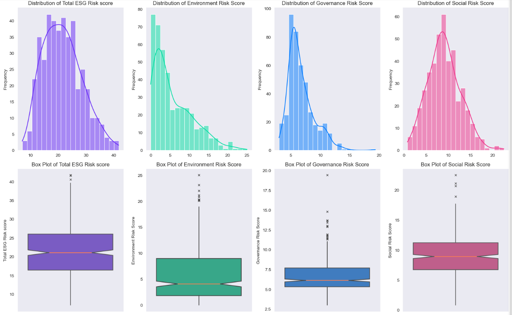
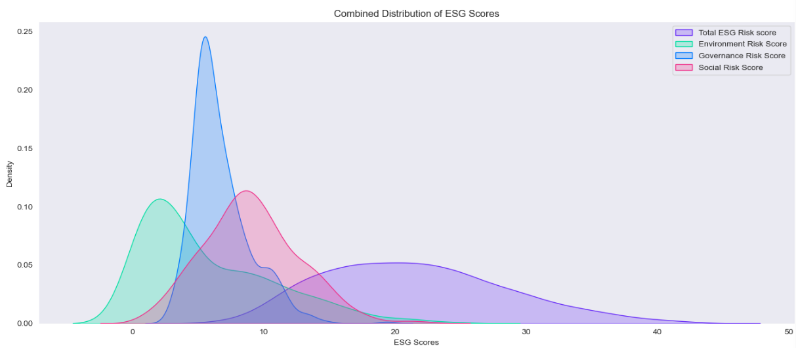

Outliers in Total ESG Risk score:

|     | Total ESG Risk score | Environment Risk Score | Governance Risk Score | Social Risk Score |
|-----|----------------------|------------------------|-----------------------|-------------------|
| 166 |         41.7         |          25.0          |          7.0          |        9.7        |
| 297 |         40.5         |          14.2          |         10.9          |       15.4        |
| 324 |         41.6         |          23.1          |          8.5          |       10.0        |


Outliers in Environment Risk Score:

|     | Total ESG Risk score | Environment Risk Score | Governance Risk Score | Social Risk Score |
|-----|----------------------|------------------------|-----------------------|-------------------|
| 41  |         32.6         |          20.1          |          5.0          |        7.4        |
| 146 |         35.4         |          20.8          |          5.8          |        8.8        |
| 166 |         41.7         |          25.0          |          7.0          |        9.7        |
| 219 |         37.7         |          21.1          |          7.6          |        9.1        |
| 324 |         41.6         |          23.1          |          8.5          |       10.0        |
| 339 |         34.2         |          20.2          |          7.3          |        6.7        |
| 372 |         36.1         |          20.3          |          7.5          |        8.3        |
| 465 |         38.8         |          22.0          |          8.0          |        8.9        |


Outliers in Governance Risk Score:

|     | Total ESG Risk score | Environment Risk Score | Governance Risk Score | Social Risk Score |
|-----|----------------------|------------------------|-----------------------|-------------------|
| 20  |         36.2         |          2.0           |         19.4          |       14.8        |
| 29  |         21.8         |          2.0           |         11.9          |        7.9        |
| 51  |         30.3         |          1.8           |         13.0          |       15.5        |
| 75  |         23.3         |          2.4           |         11.9          |        8.9        |
| 126 |         27.0         |          2.3           |         13.4          |       11.2        |
| 147 |         28.5         |          3.4           |         11.5          |       13.5        |
| 220 |         26.5         |          2.6           |         13.6          |       10.3        |
| 224 |         16.4         |          0.6           |         11.5          |        4.3        |
| 246 |         29.3         |          1.1           |         11.7          |       16.5        |
| 290 |         25.5         |          0.9           |         11.8          |       12.8        |
| 384 |         25.2         |          2.5           |         11.7          |       11.0        |
| 392 |         23.5         |          2.0           |         11.4          |       10.1        |
| 393 |         29.2         |          1.8           |         13.7          |       13.8        |
| 396 |         25.6         |          1.8           |         12.9          |       11.0        |
| 435 |         23.4         |          2.5           |         11.3          |        9.6        |
| 441 |         20.7         |          1.0           |         14.8          |        4.9        |
| 446 |         28.3         |          1.7           |         11.5          |       15.1        |
| 457 |         24.1         |          1.6           |         11.7          |       10.8        |
| 475 |         24.2         |          1.6           |         12.9          |        9.7        |
| 484 |         24.2         |          1.6           |         11.5          |       11.2        |

Outliers in Social Risk Score:

|     | Total ESG Risk score | Environment Risk Score | Governance Risk Score | Social Risk Score |
|-----|----------------------|------------------------|-----------------------|-------------------|
| 42  |         33.0         |          3.7           |          8.6          |       20.7        |
| 205 |         34.1         |          2.7           |         10.3          |       21.1        |
| 298 |         35.2         |          9.4           |          6.9          |       18.9        |
| 434 |         39.6         |          8.8           |          8.3          |       22.5        |

**Calculating the shape of the data with no outliers**
```python

data_no_outliers = df.copy()
Esg_scores = df[['Total ESG Risk score', 'Environment Risk Score', 'Governance Risk Score', 'Social Risk Score']]

# Identify and remove outliers
for col in Esg_scores.columns:
    Q1 = Esg_scores[col].quantile(0.25)
    Q3 = Esg_scores[col].quantile(0.75)
    IQR = Q3 - Q1
    lower_bound = Q1 - 1.5 * IQR
    upper_bound = Q3 + 1.5 * IQR

    # Remove outliers from the copy of the dataset
    data_no_outliers = data_no_outliers[(data_no_outliers[col] >= lower_bound) & (data_no_outliers[col] <= upper_bound)]

# Reset the index of the new DataFrame
data_no_outliers.reset_index(drop=True, inplace=True)

# Display the shape of the new dataset without outliers
print(f"Shape of the dataset without outliers: {data_no_outliers.shape}")
```
Shape of the dataset without outliers: (397, 15)

**Creating a visual of Distribution of ESG Risk Levels**
```python
sns.countplot(data=df, x='ESG Risk Level', order=df['ESG Risk Level'].value_counts().index)
plt.title("Distribution of ESG Risk Levels")
plt.show()
```
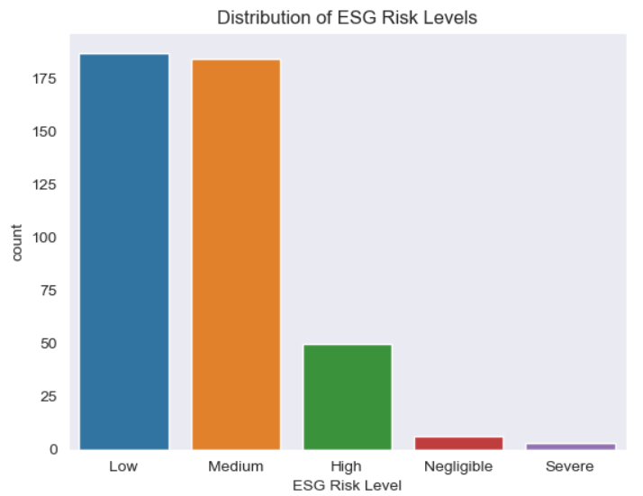

 **Creating a visual of Average Total ESG Score of each  ESG Risk level**
```python

risk_levels = ['Negligible', 'Low', 'Medium', 'High']

# Group and filter based on risk levels
grouped_data = (
    data_no_outliers
    .groupby('ESG Risk Level', observed=True)['Total ESG Risk score']
    .mean()
    .reindex(risk_levels)  # Ensures order
    .reset_index()
)

# Set style and color palette
sns.set_style("dark")
palette = sns.color_palette("crest", len(risk_levels))

# Plot bar chart
fig, ax = plt.subplots(figsize=(10, 6))
bars = ax.bar(grouped_data['ESG Risk Level'], grouped_data['Total ESG Risk score'], color=palette)

# Titles and labels
ax.set_title('Total ESG Risk Score by ESG Risk Level', fontsize=15)
ax.set_xlabel('ESG Risk Level')
ax.set_ylabel('Mean Total ESG Risk Score')

# Add value labels
for bar in bars:
    height = bar.get_height()
    ax.annotate(f'{height:.2f}', 
                xy=(bar.get_x() + bar.get_width()/2, height),
                xytext=(0, 3), 
                textcoords="offset points",
                ha='center', va='bottom',
                fontsize=10, color='black', alpha=0.6)


plt.tight_layout()
plt.show()
```
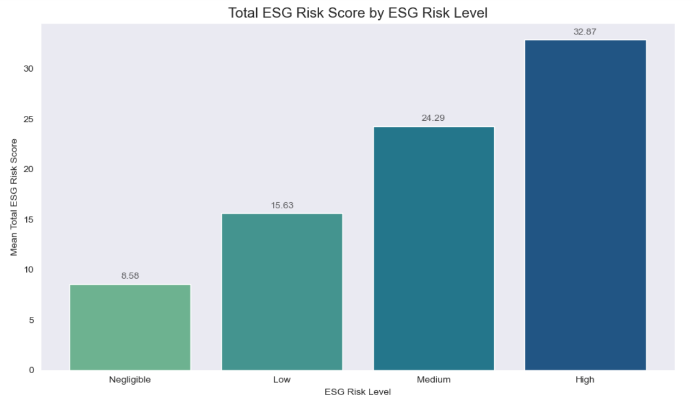

**Creating a visual of Frequency count of each Sector**
```python

sector_counts = df['Sector'].value_counts().reset_index()
sector_counts.columns = ['Sector', 'Frequency']

# Create a bar chart using Plotly Express
fig = px.bar(sector_counts, x='Frequency', y='Sector', orientation='h', 
             title='S&P 500 Sectors', text='Frequency',
             labels={'Frequency': 'Frequency Count', 'Sector': 'Sector'},
             color='Sector', color_continuous_scale= px.colors.sequential.Viridis_r,
            template='plotly_dark')

# Customize the layout
fig.update_traces(texttemplate='%{text}', textposition='outside')
fig.update_layout(showlegend=False)

# Show the plot
fig.show()
```
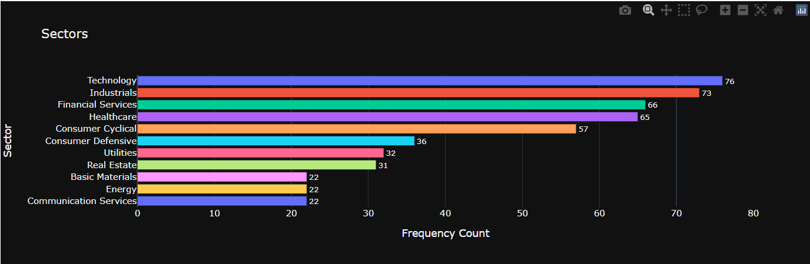

**Creating visuals of Sector-wise and Industry-wise average Environment, Social, Governance Risk score and Sector-wise Total ESG score**
```python
# Calculate sector-wise average ESG scores
sector_avg_scores = df.groupby('Sector')[['Environment Risk Score', 'Governance Risk Score', 'Social Risk Score']].mean().reset_index()

# Melt the DataFrame to long format(unpivot) for proper Plotly bar chart rendering
sector_long = sector_avg_scores.melt(id_vars='Sector', 
                                     value_vars=['Environment Risk Score', 'Governance Risk Score', 'Social Risk Score'],
                                     var_name='ESG Component', 
                                     value_name='Average Score')

# Industry-wise average scores
industry_avg_scores = df.groupby('Industry')[['Environment Risk Score', 'Governance Risk Score', 'Social Risk Score']].mean().reset_index()

industry_long = industry_avg_scores.melt(id_vars='Industry',
                                         value_vars=['Environment Risk Score', 'Governance Risk Score', 'Social Risk Score'],
                                         var_name='ESG Component', 
                                         value_name='Average Score')

# Define custom colors for ESG components
custom_colors = {
    'Environment Risk Score': "#FFA500",
    'Governance Risk Score': "#FFFFFF",
    'Social Risk Score': "#87CEEB"
}

# --- Sector-wise ESG Bar Chart ---
fig_sector = px.bar(
    sector_long,
    x='Average Score',
    y='Sector',
    color='ESG Component',
    orientation='h',
    title='Sector-wise Average ESG Scores',
    color_discrete_map=custom_colors,
    template='plotly_dark',
    width=1000,
    height=700,
    text='Average Score'
)

fig_sector.update_traces(texttemplate='%{text:.2f}', textposition='outside')
fig_sector.update_layout(barmode='group', xaxis_title='Average ESG Score', yaxis_title='Sector')
fig_sector.show()

# --- Industry-wise ESG Bar Chart ---
fig_industry = px.bar(
    industry_long,
    x='Average Score',
    y='Industry',
    color='ESG Component',
    orientation='h',
    title='Industry-wise Average ESG Scores',
    color_discrete_map=custom_colors,
    template='plotly_dark',
    width=1000,
    height=1000,
    text='Average Score'
)

fig_industry.update_traces(texttemplate='%{text:.2f}', textposition='outside')
fig_industry.update_layout(barmode='group', xaxis_title='Average ESG Score', yaxis_title='Industry')
fig_industry.show()

plt.figure(figsize=(12,6))
sns.barplot(data=df, x='Sector', y='Total ESG Risk score', estimator=np.mean, errorbar=None)
ax = sns.barplot(x='Sector', y='Total ESG Risk score', data=df, errwidth=0)
ax.bar_label(ax.containers[0], fontsize = 12)

plt.xticks(rotation=45)
plt.title("Average  Total ESG Risk Score by Sector")
plt.tight_layout()
plt.show()
```
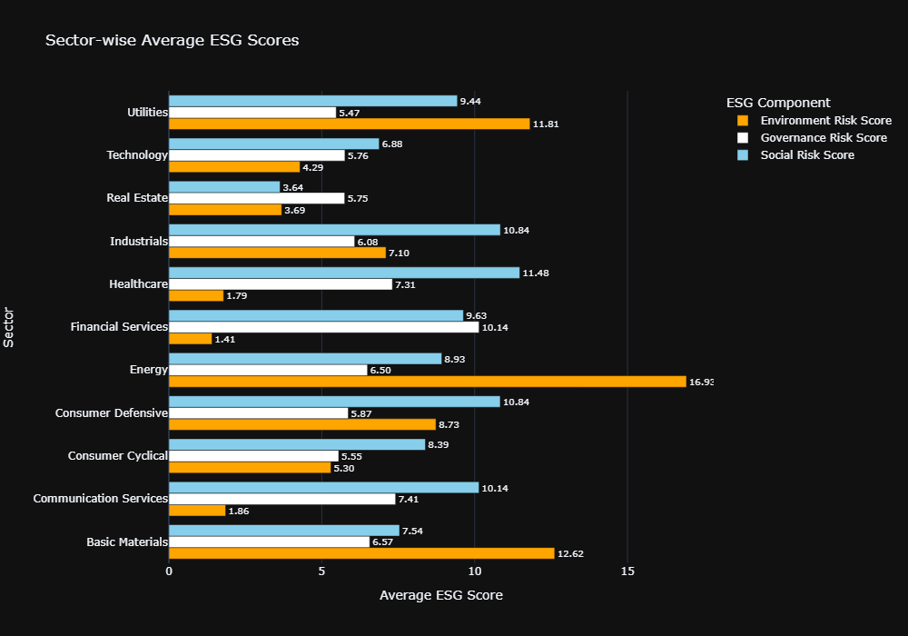
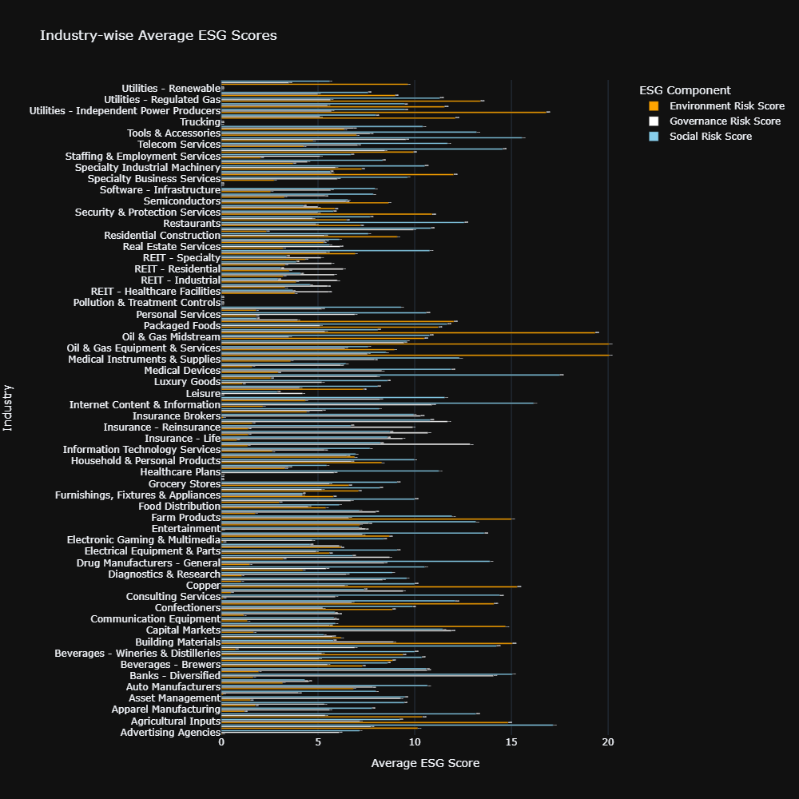
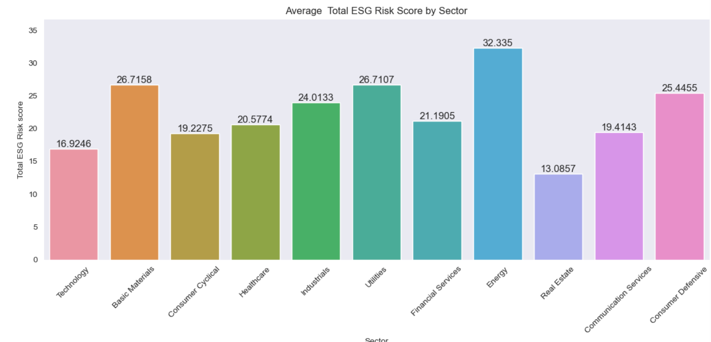

**Creating visuals of top 10 Industry by each ESG components having high risk scores**
```python

# Calculate industry-wise average ESG scores
industry_avg_scores = df.groupby('Industry')[['Environment Risk Score', 'Governance Risk Score', 'Social Risk Score']].mean().reset_index()

# Define custom colors
custom_colors = {
    'Environment Risk Score': "#FFA500",
    'Governance Risk Score': "#FFFFFF",
    'Social Risk Score': "#7b68ee"
}

# Top 10 industries by each ESG component
top_env = industry_avg_scores.nlargest(10, 'Environment Risk Score')
top_gov = industry_avg_scores.nlargest(10, 'Governance Risk Score')
top_soc = industry_avg_scores.nlargest(10, 'Social Risk Score')

# Plot for Environment Risk Score
fig_env = px.bar(
    top_env.sort_values(by='Environment Risk Score', ascending=True),
    x='Environment Risk Score',
    y='Industry',
    orientation='h',
    title='Top 10 Industries by Environment Risk Score',
    color_discrete_sequence=[custom_colors['Environment Risk Score']],
    text='Environment Risk Score',
    template='plotly_dark',
    width=900,
    height=500
)
fig_env.update_traces(texttemplate='%{text:.2f}', textposition='outside')
fig_env.update_layout(xaxis_title='Average Score', yaxis_title='Industry')
fig_env.show()

# Plot for Governance Risk Score
fig_gov = px.bar(
    top_gov.sort_values(by='Governance Risk Score', ascending=True),
    x='Governance Risk Score',
    y='Industry',
    orientation='h',
    title='Top 10 Industries by Governance Risk Score',
    color_discrete_sequence=[custom_colors['Governance Risk Score']],
    text='Governance Risk Score',
    template='plotly_dark',
    width=900,
    height=500
)
fig_gov.update_traces(texttemplate='%{text:.2f}', textposition='outside')
fig_gov.update_layout(xaxis_title='Average Score', yaxis_title='Industry')
fig_gov.show()

# Plot for Social Risk Score
fig_soc = px.bar(
    top_soc.sort_values(by='Social Risk Score', ascending=True),
    x='Social Risk Score',
    y='Industry',
    orientation='h',
    title='Top 10 Industries by Social Risk Score',
    color_discrete_sequence=[custom_colors['Social Risk Score']],
    text='Social Risk Score',
    template='plotly_dark',
    width=900,
    height=500
)
fig_soc.update_traces(texttemplate='%{text:.2f}', textposition='outside')
fig_soc.update_layout(xaxis_title='Average Score', yaxis_title='Industry')
fig_soc.show()
```
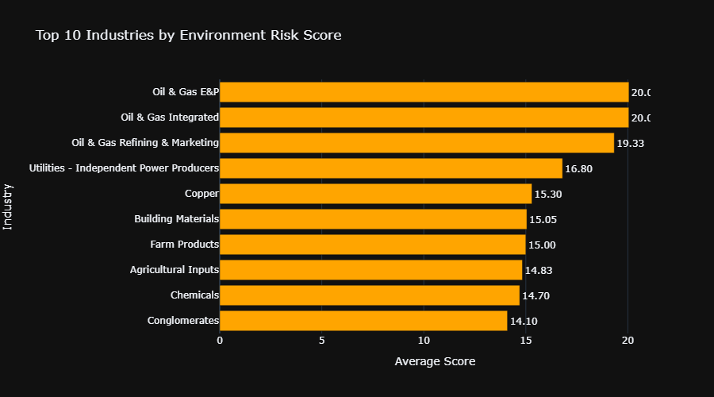
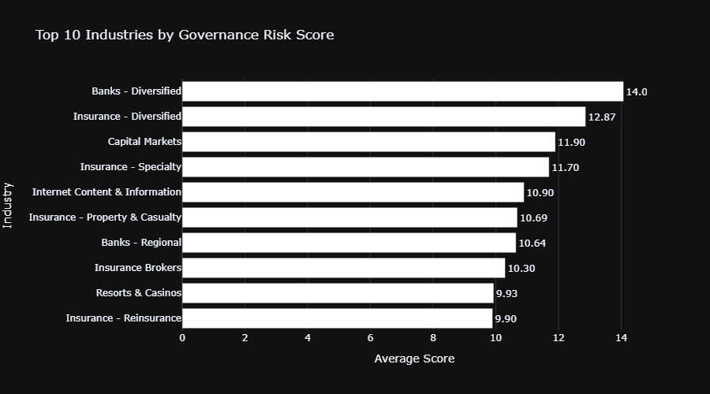
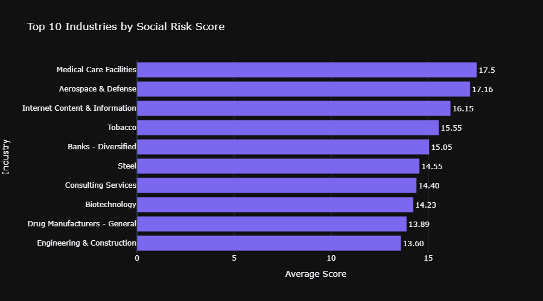

**Creating a correlation heatmap of ESG components**
```python
plt.figure(figsize=(12, 8))
sns.set_style("dark")

# Create the correlation matrix
corr = Esg_scores.corr()

sns.heatmap(corr, cmap='Greens', annot=True, fmt=".2f", cbar=True, linewidths=0.5, square=True, vmin=-1, vmax=1)

plt.title("Correlation Heatmap of ESG Scores", fontsize=17)
plt.xticks(rotation=45, fontsize=8)
plt.yticks(rotation=0, fontsize=8)
plt.tight_layout()
plt.show()

```
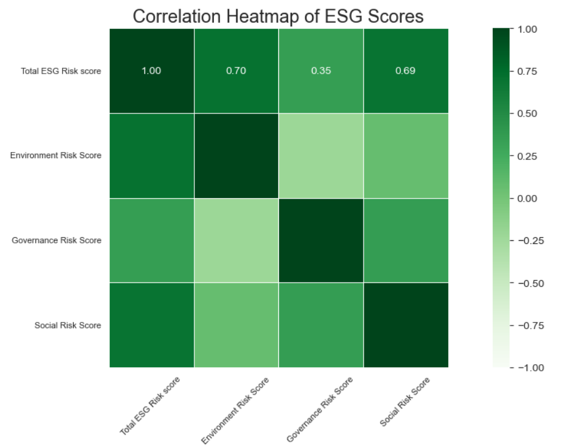

**Creating a visual to check the relation of Governance risk score with Total ESG risk score**
```python
plt.figure(figsize=(10,6))
sns.scatterplot(data=df, x='Governance Risk Score', y='Total ESG Risk score')
sns.regplot(data=df, x='Governance Risk Score', y='Total ESG Risk score', scatter=False, color='red')
plt.title("Governance Score vs Total ESG Risk")
plt.show()
```
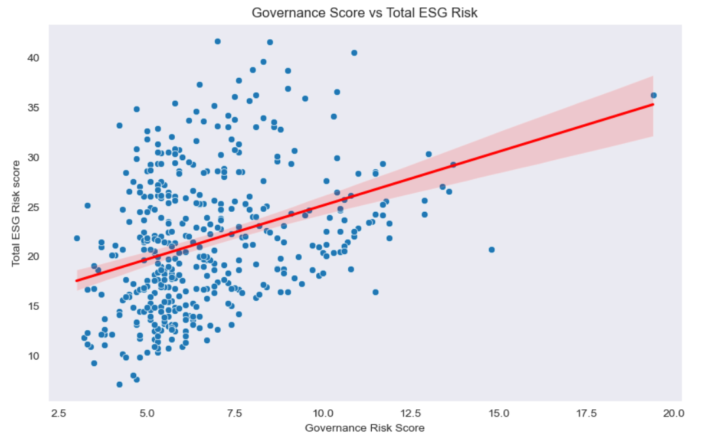


## Power BI Dashboard
  **Overview Page**:  
  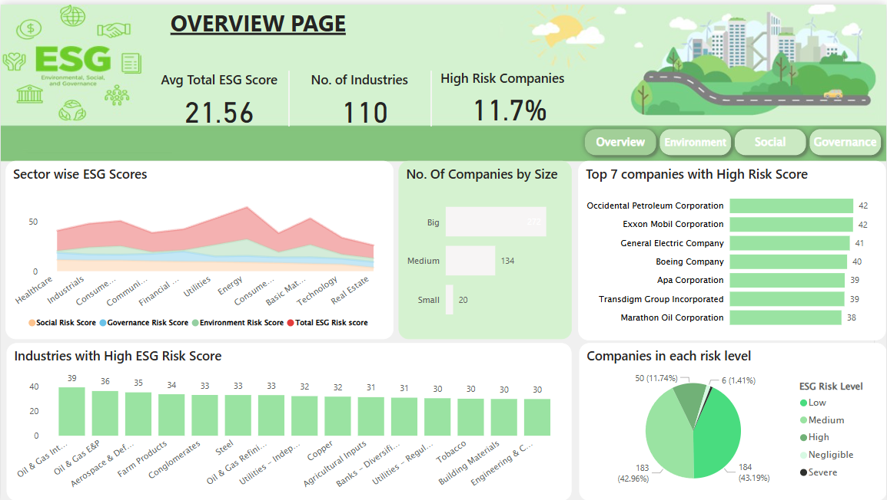

  **Environment Risk Page**:
  
  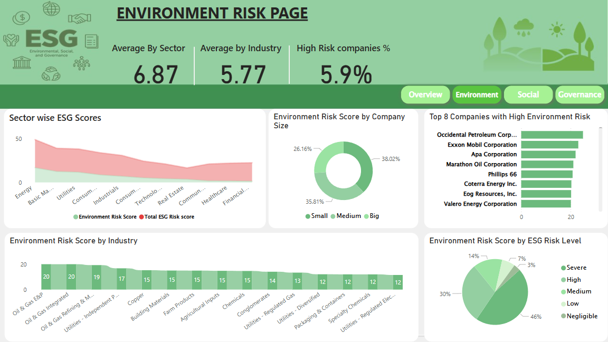

  **Social Risk Page**:
   
  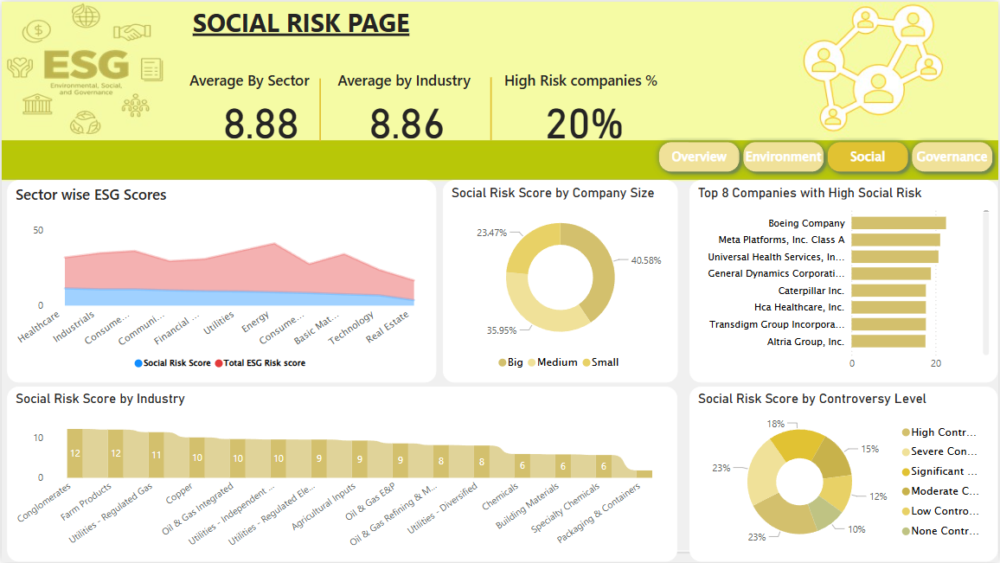

  **Governance Page**:
    
  

 ** Dashboard:** [ESG-Risk-Analysis-Dashboard](https://app.powerbi.com/view?r=eyJrIjoiM2Y0MGVlM2ItNDJiZS00ZjViLWI3MzUtY2I2M2Q0YWNhMjljIiwidCI6ImRiOThlOTIzLWQyZWEtNDY2MS1hZDE1LTI3YzUyNjA2MGEyYiJ9)

## Key Insights
- Both Occidental Petroleum Corporation and Exxon Mobile Corporation companies have equal and high Total ESG Risk Score. They also come under as top 2 comapnies with High Environment Risk Score.
- Environment risk has the highest correlation with Total ESG score.
- Energy and Materials sectors are the most ESG-risk-prone
- Big Companies (with >15,000 employees) tend to have higher governance and Social risks but have a lower Environment Risk.
- Controversy level strongly influences overall ESG risk perception.


## Contact
**Sahil Patra**  
GitHub: [Github-page](https://github.com/Sahil-Patra)  
Email: sahilpatra1004@gmail.com
Ph no.: +91 7735367833
---

**Thank you for checking out this project!** 


---
