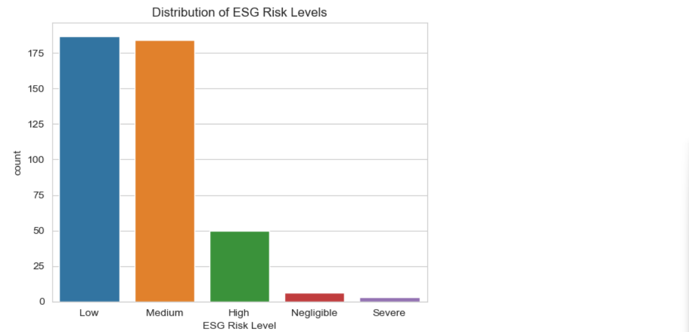

# ESG-Risk-Analysis:  Uncovering Hidden Risks in Corporate Responsibility

To identify ESG risk patterns across sectors, company sizes, and governance practices using Python-based data analysis and visualization, delivering insights that could support sustainable investing decisions and risk mitigation strategies.

## Table of Contents
- [About the Project](#About-the-Project)
- [Objectives](#Objectives)
- [Tools Used](#Tools-Used)
- [Data Source](#Data-Source)
- [Executive Summary](Executive-Summary)
- [Technical Analysis](#Technical-Analysis)
   - [SQL Queries](#SQL-Queries)
   - [Python Code](#Python-Code)
- [Power BI Dashboard](#Power-BI-Dashboard)
- [Recommendation](#Recommendation)
- [Contact](#contact)

---

## About the Project
This project provides a comprehensive analysis of Environmental, Social, and Governance (ESG) risks across companies and industries, leveraging Python, SQL, and Power BI to uncover hidden patterns and support informed decision-making. 

Built to assist investors, financial analysts, ESG strategists, and regulatory teams, the project aggregates and visualizes ESG performance data, controversy indicators, and governance quality metrics. It identifies high-risk entities, industry-level ESG benchmarks, and compliance red flags, enabling stakeholders to align investments and business decisions with sustainability, ethics, and long-term risk management goals.

The analysis focuses on three core ESG dimensions:

Environmental: Carbon footprint, resource usage, and environmental violations

Social: Labor practices, human rights, diversity, and public controversies

Governance: Board independence, executive compensation, transparency, and audit integrity

Why it matters: In today’s ESG-conscious world, companies with poor ESG performance face regulatory pressure, reputational damage, and declining investor confidence. This project helps stakeholders proactively manage those risks by translating ESG data into actionable business and investment intelligence.

## Objectives
The objectives of the project are to analyze and discover:
- Industry-Wide ESG Risk Benchmarking
- Identifying High-Risk Companies and Controversies
- Relationship Between ESG Risk and Company Size
- Governance and ESG Risk Correlation
  
## Tools Used
- **SQL**: For structured querying & analysis.
- **Python**: For deep data exploration using pytohn libraries such as Pandas, Matplotlib, Seaborn, Plotly.express etc.
- **Power BI**: For creating interactive ESG dashboards.

## Data Source
This project uses sample data that simulates typical ESG data:
- Symbol: The unique stock symbol associated with the company
- Name: The official name of the company.
- Address: The primary address of the company's headquarters.
- Sector: The sector of the economy in which the company operates.
- Industry: The specific industry to which the company belongs.
- Full Time Employees: The total count of full-time employees working within the company.
- Description: A concise overview of the company's core business and activities.
- Total ESG Risk Score: An aggregate score evaluating the company's overall ESG risk.
- Environment Risk Score: A score indicating the company's environmental sustainability and impact.
- Governance Risk Score: A score reflecting the quality of the company's governance structure.
- Social Risk Score: A score assessing the company's societal and employee-related practices.
- Controversy Level: The level of controversies associated with the company's ESG practices.
- Controversy Score: A numerical representation of the extent of ESG-related controversies.
- ESG Risk Percentile: The company's rank in terms of ESG risk compared to others.
- ESG Risk Level: A categorical indication of the company's ESG risk level.

## Executive Summary
This ESG Risk Analysis uncovers key risk signals that inform smarter, sustainable investment decisions. Notably, Occidental Petroleum and Exxon Mobil emerge as the highest-risk entities, driven largely by elevated environmental risk, positioning them at the top of ESG concern for energy sector exposure.

Analysis confirms that environmental risk is the most influential driver of total ESG scores — a critical insight for investors managing climate-linked asset exposure. The Energy and Materials sectors, in particular, present consistently high ESG risk, requiring focused monitoring and engagement.

Larger companies (15,000+ employees) show a reduced environmental footprint per risk score, yet face heightened governance and social risks, likely due to operational complexity and reputational exposure.

Additionally, the presence of ESG controversies significantly elevates overall risk perception, underscoring the need for real-time tracking of red flags, not just static risk ratings.

These insights enable investors to identify high-risk holdings, adjust sector allocations, and apply ESG filters with greater precision, aligning portfolios with long-term sustainability and compliance goals.

## Business Questions Answered
- Which companies show elevated ESG risk across environmental, social, or governance factors?
- How do ESG risks vary across industries or regions?
- Which companies face ongoing controversies or non-compliance issues that may require further investigation?
- Are there outliers whose ESG performance significantly deviates from industry benchmarks?
- How can we use ESG insights to guide responsible investing, due diligence, or divestment decisions?
- What are the key areas of improvement for a company to reduce long-term ESG-related risk exposure?


## Technical Analysis

### SQL Queries

**Column names and their data types**
```SQL
SELECT COLUMN_NAME, DATA_TYPE
FROM INFORMATION_SCHEMA.COLUMNS
WHERE TABLE_NAME = 'SP_500_ESG_Risk_Ratings'; 
```
**Column Name and Their Datatypes**

SELECT COLUMN_NAME, DATA_TYPE
FROM INFORMATION_SCHEMA.COLUMNS
WHERE TABLE_NAME = 'SP_500_ESG_Risk_Ratings'; 

**Cleaning and changing the datatypes of columns**
```SQL
UPDATE SP_500_ESG_Risk_Ratings
SET Environment_Risk_Score = NULLIF(LTRIM(RTRIM(REPLACE(Environment_Risk_Score, ',', ''))), '');;

UPDATE SP_500_ESG_Risk_Ratings
SET Governance_Risk_Score = NULLIF(LTRIM(RTRIM(REPLACE(Governance_Risk_Score, ',', ''))), '');

--
UPDATE SP_500_ESG_Risk_Ratings
SET Social_Risk_Score = NULLIF(LTRIM(RTRIM(REPLACE(Social_Risk_Score, ',', ''))), '');

--
UPDATE SP_500_ESG_Risk_Ratings
SET Total_ESG_Risk_score = NULLIF(LTRIM(RTRIM(REPLACE(Total_ESG_Risk_score, ',', ''))), '');

--
UPDATE SP_500_ESG_Risk_Ratings
SET Controversy_Score = NULLIF(LTRIM(RTRIM(REPLACE(Controversy_Score, ',', ''))), '');

UPDATE SP_500_ESG_Risk_Ratings
SET Controversy_Score = REPLACE(Controversy_Score, 'N/A', '0');

UPDATE SP_500_ESG_Risk_Ratings
SET Controversy_Score = Coalesce(Controversy_Score, '0');

ALTER TABLE SP_500_ESG_Risk_Ratings
ALTER COLUMN Controversy_Score Integer;
```
**Industry-wide average ESG component scores**
```SQL
SELECT
    Industry,
    Round(AVG(Environment_Risk_Score), 2) AS Avg_Environment,
    Round(AVG(Governance_Risk_Score), 2) AS Avg_Governance,
    Round(AVG(Social_Risk_Score), 2) AS Avg_Social
FROM SP_500_ESG_Risk_Ratings
GROUP BY Industry
ORDER BY Industry;
```

**No. of companies by ESG risk level**
```SQL
SELECT ESG_Risk_Level, COUNT(*) AS Company_Count
FROM SP_500_ESG_Risk_Ratings
WHERE ESG_Risk_Level IS NOT NULL
GROUP BY ESG_Risk_Level
ORDER BY Company_Count DESC;
```

**ESG score by risk category**
```SQL
SELECT ESG_Risk_Level,
       AVG(Total_ESG_Risk_score) AS Avg_Total_ESG
FROM SP_500_ESG_Risk_Ratings
GROUP BY ESG_Risk_Level;
```


**Governance vs ESG score**
```SQL
SELECT ROUND(AVG(Governance_Risk_Score), 2) AS Avg_Gov,
       ROUND(AVG(Total_ESG_Risk_Score), 2) AS Avg_Total
FROM SP_500_ESG_Risk_Ratings;
```


### Python Code
Importing all the necessary library
```python
import pandas as pd
import numpy as np
import seaborn as sns
import matplotlib.pyplot as plt
%matplotlib inline
import plotly.express as px
import warnings
warnings.filterwarnings('ignore')
```

Importing the CSV data
```python
df = pd.read_csv('SP 500 ESG Risk Ratings.csv')
```


```Python
esg_cols = ['Total ESG Risk score', 'Environment Risk Score', 'Governance Risk Score', 'Social Risk Score']

sns.set_style("whitegrid")  

for col in esg_cols:
    fig, axes = plt.subplots(1, 2, figsize=(12, 5))

    # Histogram with KDE
    sns.histplot(df[col], kde=True, ax=axes[0], color='skyblue')
    axes[0].set_title(f'Distribution of {col}')
    axes[0].set_xlabel(col)
    axes[0].set_ylabel('Frequency')

    # Boxplot
    sns.boxplot(y=df[col], ax=axes[1], color='lightgreen')
    axes[1].set_title(f'Boxplot of {col}')
    axes[1].set_xlabel('')
    axes[1].set_ylabel(col)

    plt.tight_layout()
    plt.show()
```


```Python
colors = ["#6528F7", "#00DFA2", "#0079FF", "#EF2F88"]

plt.figure(figsize=(13.6, 6))
for i, col in enumerate(esg_cols):
    sns.kdeplot(df[col], label=col, fill=True, color=colors[i])
    
plt.title("Combined Distribution of ESG Scores")
plt.xlabel("ESG Scores")
plt.ylabel("Density")
plt.legend()
plt.tight_layout()
plt.show()
```


**Removing outlier using IQR**
```Python
df_no_outliers = df.copy()
for col in esg_cols:
    Q1 = df[col].quantile(0.25)
    Q3 = df[col].quantile(0.75)
    IQR = Q3 - Q1
    lower = Q1 - 1.5 * IQR
    upper = Q3 + 1.5 * IQR
    df_no_outliers = df_no_outliers[(df_no_outliers[col] >= lower) & (df_no_outliers[col] <= upper)]
```
**Plotting no. of companies by sector**
```Python
sector_counts = df['Sector'].value_counts().reset_index()
sector_counts.columns = ['Sector', 'Frequency']

# Create a bar chart using Plotly Express
fig = px.bar(sector_counts, x='Frequency', y='Sector', orientation='h', 
             title='Sectors', text='Frequency',
             labels={'Frequency': 'Frequency Count', 'Sector': 'Sector'},
             color='Sector',
            template='plotly_dark')

# Customize the layout
fig.update_traces(texttemplate='%{text}', textposition='outside')
fig.update_layout(showlegend=False)

# Show the plot
fig.show()
```


**Plotting ESG risk level distribution**
```python
sns.countplot(data=df, x='ESG Risk Level', order=df['ESG Risk Level'].value_counts().index)
plt.title("Distribution of ESG Risk Levels")
plt.show()
```


**ESG Component Correlation Heatmap**
```Python
corr = df[esg_cols].corr()
sns.heatmap(corr, annot=True, cmap="Greens")
plt.title("Correlation Heatmap of ESG Scores")
plt.show()
```


**Governance Score vs. Total ESG Risk (Trend Insight)**
```Python
sns.scatterplot(data=df, x='Governance Risk Score', y='Total ESG Risk score')
sns.regplot(data=df, x='Governance Risk Score', y='Total ESG Risk score', scatter=False, color='red')
plt.title("Governance vs Total ESG Risk Score")
plt.show()
```


## Power BI Dashboard

 ** Dashboard:** [ESG-Risk-Analysis-Dashboard](https://app.powerbi.com/view?r=eyJrIjoiM2Y0MGVlM2ItNDJiZS00ZjViLWI3MzUtY2I2M2Q0YWNhMjljIiwidCI6ImRiOThlOTIzLWQyZWEtNDY2MS1hZDE1LTI3YzUyNjA2MGEyYiJ9)

## Recommendation

**Reduce Exposure to High-Risk Energy Holdings**
  Given the elevated total and environmental risk scores of companies like Occidental Petroleum and Exxon Mobil, investors should consider:
- Rebalancing portfolios to limit concentration in fossil-fuel-intensive firms
- Engaging with these companies on measurable environmental performance goals
- Applying ESG exclusion filters or carbon footprint screens to avoid outsized risk exposure

**Prioritize Environmental Risk as a Leading Indicator**
  Since environmental risk is the strongest predictor of overall ESG performance, ESG investment strategies should:
- Weight E-scores more heavily in screening models and portfolio scoring
- Prioritize companies with measurable decarbonization targets
- Use sector-specific E-risk benchmarks to differentiate high- vs. low-performing peers

**Apply Sector-Specific Risk Weighting**
  The Energy and Materials sectors show systemic ESG vulnerabilities. Consider:
- Allocating capital toward transitional or lower-risk segments within these sectors (e.g., renewable energy, sustainable mining)
- Applying sector-adjusted ESG thresholds in your investment filters

**Reassess Governance and Social Oversight in Large-Cap Holdings**
Large companies (>15,000 employees) show lower environmental risk but higher governance and social risks. Investors should:
- Include board diversity, labor practices, and supply chain audits in engagement agendas
- Pressure firms to improve governance disclosures and stakeholder management

**Integrate Real-Time Controversy Tracking into Risk Monitoring**
Controversies have a strong influence on ESG perception and can lead to sudden reputational and regulatory risks. Mitigation steps include:
- Incorporating controversy alerts and sentiment tracking into ESG dashboards
- Flagging companies with recurring incidents for enhanced due diligence or divestment review


## Contact
**Sahil Patra**  
GitHub: [Github-page](https://github.com/Sahil-Patra)  
Email: sahilpatra1004@gmail.com
Ph no.: +91 7735367833
---

**Thank you for checking out this project!** 


---
